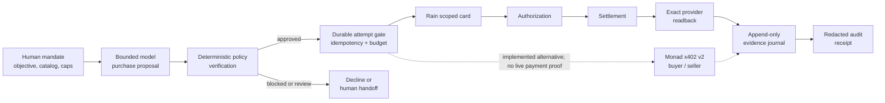

# SpendForge

[](https://github.com/VJDiPaola/SpendForge/actions/workflows/verify.yml)

**Autonomous microprocurement with policy-bound payments and receipts you can audit.**

SpendForge lets an AI agent select low-value, machine-deliverable resources—API
access, dataset slices, compute, verification, and digital licenses—inside a
human-set mandate. The model proposes; deterministic code enforces price,
vendor, evidence, and budget rules; provider readback closes the ledger.

> **The agent decides. Policy constrains it. Rain executes the payment.
> SpendForge proves the result.**

[**Open the public demo**](https://spendforge.vercel.app) ·
[**Run the guided mission**](https://spendforge.vercel.app/missions/atlas-launch-v1) ·
[**View the completed Rain receipt**](https://spendforge.vercel.app/api/audit/receipts/audit_rain_northstar_completed_20260809_v1) ·
[Architecture](#architecture) ·
[75-second demo script](./docs/DEMO-SCRIPT.md)


The public Production deployment is a safe guided demo and contains no provider
credentials or mutation gates. Live provider proofs ran through protected,
one-shot Preview execution surfaces that were removed after use.

## Proven today

| Evidence | Verified result | Inspect |
|---|---|---|
| Bounded model decision | One live OpenAI Responses call produced a strict purchase proposal; no tools or retries were enabled. | [Decision contract](./docs/OPENAI-DECISION.md), [ledger](https://spendforge.vercel.app/ledger#live-agent-decision-evidence) |
| Deterministic policy | Typed code independently rechecked quote, cap, vendor, MCC, evidence, duplicate state, and prompt-injection risk. The model has no payment authority. | [`verifyPurchaseProposal`](./src/lib/decision/policy.ts), [policy tests](./tests/unit/decision-policy.test.ts) |
| Completed Rain Sandbox spend | Rain issued a scoped virtual card, accepted a 12-cent authorization and settlement, and exact transaction readback returned `spend.status=completed` with the expected card, user, amount, currency, merchant, MCC, and type. No production funds moved. | [Completed redacted receipt](https://spendforge.vercel.app/api/audit/receipts/audit_rain_northstar_completed_20260809_v1), [receipt builder](./src/lib/operations/rain-sandbox.ts) |
| Durable operation evidence | A Preview-only Postgres journal uses append-only records and compare-and-set duplicate claims; its runtime role is limited to `SELECT` and `INSERT`. | [Migration](./migrations/001_provider_operation_journal.sql), [setup and proof](./docs/DURABLE-JOURNAL-SETUP.md) |
| Downloadable audit receipts | Public receipts contain masked references, value-free response shapes, evidence codes, and authoritative readback state—never PAN, CVC, keys, or recovery plaintext. | [Receipt route](./src/app/api/audit/receipts/%5BreceiptId%5D/route.ts), [security model](./SECURITY.md) |
| Monad/x402 boundary | Official x402 v2 packages, buyer/seller adapters, caps, durable attempt gates, and fake contract tests are implemented. A read-only `/supported` check passed; **no live Monad payment is claimed**. | [Preflight](./docs/MONAD-X402-PREFLIGHT.md), [contract tests](./tests/contract/x402-official-adapter.test.ts) |

The live model proposal selected Pulse at one cent; the completed Rain proof was
a separate, bounded Northstar sandbox purchase at 12 cents. Both are genuine
proofs of their respective boundaries. The guided mission demonstrates the
combined product contract, but it is not presented as a single canonical live
run.

## Product scope

SpendForge is designed for low-value, preapproved, machine-deliverable
purchases:

- metered API access and enrichment or verification calls;
- dataset slices and licensed machine-readable content;
- compute, model inference, test infrastructure, and sandbox time;
- OCR, transcription, and other usage-based tools;
- digital media or code licenses available through a programmatic merchant.

It is not a replacement for negotiated contracts, legal or tax review, vendor
onboarding, enterprise software procurement, seat lifecycle, renewals, or
cancellations. A future [Checkout Operator](./docs/CHECKOUT-OPERATOR.md) can
route merchant challenges to authenticated human approval; it does not bypass
CAPTCHA, 3DS, fraud checks, login, or changed terms.

## Architecture



Provider responses and authoritative readbacks are different states. Rain is
not marked completed until the matching direct GET proves the expected terminal
record. An x402 settlement receipt and delivered resource likewise remain
separate evidence.

### Responsibility boundary

| System | Owns |
|---|---|
| Model | A strict, structured purchase proposal inside the supplied catalog and mandate |
| SpendForge | Policy verification, integer-money accounting, attempt gates, delivery checks, evidence, and receipts |
| Rain | Scoped cards, authorization, settlement, and authoritative card/transaction records |
| Monad/x402 | HTTP payment negotiation, signature verification, facilitator settlement, wallet/network primitives, and chain receipts |

## Truth boundaries

| Surface | Current truth |
|---|---|
| Public Production | Guided fixture mission; non-mutating; no provider credentials |
| OpenAI evidence | One live bounded proposal, separately policy-verified; execution surface removed |
| Rain evidence | Completed simulated 12-cent Sandbox spend with exact terminal readback; historical funding acknowledgment remains uncorrelated |
| Monad evidence | Official-package and fake-contract implementation plus one read-only capability check; no wallet, payment, chain receipt, or paid delivery |
| Guided artifact | Real deterministic application behavior using labeled fixture manifests; not causally unlocked by the live Rain purchase |
| Persistence | Provider-operation CAS journal proven on protected Preview; full mission/model/delivery/artifact state is not yet one canonical database graph |

## Quickstart: fixture mode, no secrets

Requirements: Node.js 22+ and npm.

```powershell
git clone https://github.com/VJDiPaola/SpendForge.git
cd SpendForge
npm ci
npm run dev
```

Open [http://localhost:3000/missions/atlas-launch-v1](http://localhost:3000/missions/atlas-launch-v1).
The application defaults to fixture mode; no environment variables or provider
accounts are required for the guided mission.

## Server-only integration configuration

The complete names-only template is [`.env.example`](./.env.example). Never put
these values in client code, screenshots, fixtures, logs, or model prompts.
Production should remain fixture-safe; live gates belong only on an explicitly
authorized protected Preview.

| Boundary | Variable names |
|---|---|
| Runtime | `APP_BASE_URL`, `DEMO_MODE`, `MODEL_PROVIDER` |
| Durable evidence | `DATABASE_URL`, `RECOVERY_ENCRYPTION_KEY` |
| OpenAI decision | `OPENAI_API_KEY`, `OPENAI_DECISION_MODEL`, `OPENAI_DECISION_ENABLED`, `OPENAI_DECISION_PROOF_WINDOW_OPEN`, `OPENAI_DECISION_AUTHORIZED_ATTEMPT_ID` |
| Rain Sandbox identity | `RAIN_BASE_URL`, `RAIN_API_KEY`, `RAIN_USER_ID`, `RAIN_TEAM_ID`, `RAIN_CONTRACT_ID` |
| Rain execution gates | `RAIN_MUTATIONS_ENABLED`, `RAIN_CARD_ISSUANCE_ENABLED`, `RAIN_AUTHORIZATION_ENABLED`, `RAIN_SETTLEMENT_ENABLED`, `RAIN_NORTHSTAR_PROOF_WINDOW_OPEN`, `RAIN_NORTHSTAR_AUTHORIZED_ATTEMPT_ID` |
| Monad/x402 Testnet | `MONAD_CHAIN_ID`, `MONAD_NETWORK`, `MONAD_RPC_URL`, `MONAD_USDC_ADDRESS`, `MONAD_FACILITATOR_URL`, `MONAD_X402_RESOURCE_URL`, `MONAD_X402_SELLER_ADDRESS`, `MONAD_X402_MAX_AMOUNT_ATOMIC`, `MONAD_X402_BUYER_PRIVATE_KEY` |
| Monad execution gates | `MONAD_X402_PAYMENT_ENABLED`, `MONAD_X402_SELLER_ENABLED`, `MONAD_X402_AUTHORIZED_ATTEMPT_ID` |

Provider execution also requires the Preview journal and fail-closed gates. See
[durable journal setup](./docs/DURABLE-JOURNAL-SETUP.md),
[Rain workflow evidence](./docs/RAIN-WORKFLOW-VERDICT.md), and
[Monad preflight](./docs/MONAD-X402-PREFLIGHT.md).

## Repository map

| Path | Purpose |
|---|---|
| [`src/app`](./src/app) | Next.js routes, guided mission, ledger, artifact, receipts, and safe public resource endpoint |
| [`src/lib/decision`](./src/lib/decision) | Provider-neutral decision model, strict OpenAI adapter, deterministic fixture, policy verifier |
| [`src/lib/domain`](./src/lib/domain) | Integer money, mandates, offers, events, state transitions, and redaction-safe types |
| [`src/lib/integrations/rain`](./src/lib/integrations/rain) | Server-only Rain contracts, adapters, recovery, and exact readback predicates |
| [`src/lib/integrations/x402`](./src/lib/integrations/x402) | Official x402 v2 buyer/seller boundaries and safety gates |
| [`src/lib/operations`](./src/lib/operations) | Append-only journal, CAS store, response-shape capture, and audit receipts |
| [`migrations`](./migrations) | Restricted Postgres operation-journal schema |
| [`tests`](./tests) | Unit, contract, integration, eval, and browser verification |
| [`docs`](./docs) | Demo, provider evidence, architecture decisions, and operating notes |
| [`spec`](./spec) | Original product, behavior, architecture, API, UX, and evaluation contracts |

## Security model

- Provider keys, wallet keys, recovery references, and database credentials are
  server-only.
- The model receives no provider credentials and no payment tools; deterministic
  code is execution authority.
- Every provider mutation requires an operation-specific idempotency key, a
  durable pre-call claim, an exact attempt gate, and a bounded cap.
- Recovery references are AES-GCM encrypted separately from public evidence;
  PAN and CVC are never decrypted or stored.
- Public receipts expose masked references and response schemas, not raw
  provider payloads.
- Runtime persistence fails closed. Production has no provider mutation surface.

Please report vulnerabilities through [the private security process](./SECURITY.md),
not a public issue.

## Verification

```powershell
npm run lint
npm run typecheck
npm test
npm run verify:public
npm run build
```

Focused suites are also available:

```powershell
npm run test:contract
npm run test:integration
```

The fixture suites never invoke live provider adapters. CI runs install, lint,
typecheck, unit/contract tests, public-history guard, and production build on
every push.

## Documentation

- [Demo notes and exact proof posture](./DEMO-NOTES.md)
- [75-second demo script](./docs/DEMO-SCRIPT.md)
- [Adversarial judging map](./docs/JUDGING-MAP.md)
- [OpenAI decision boundary](./docs/OPENAI-DECISION.md)
- [Rain workflow evidence](./docs/RAIN-WORKFLOW-VERDICT.md)
- [Monad/x402 preflight](./docs/MONAD-X402-PREFLIGHT.md)
- [Durable journal setup](./docs/DURABLE-JOURNAL-SETUP.md)
- [Security policy](./SECURITY.md)

<details>
<summary>Original specification package</summary>

Start with [the package index](./spec/00-PACKAGE-INDEX.md), then review the
[product](./spec/01-PRODUCT-SPEC.md),
[capability boundaries](./spec/02-CAPABILITY-BOUNDARIES.md),
[behavior contract](./spec/04-BEHAVIOR-AND-AUTONOMY.md),
[technical architecture](./spec/05-TECHNICAL-ARCHITECTURE.md), and
[evaluation plan](./spec/07-EVAL-AND-TEST-PLAN.md).

</details>

## Contributing and rights

See [CONTRIBUTING.md](./CONTRIBUTING.md) before proposing a change. Keep fixture,
Sandbox, Testnet, and production evidence explicitly separated; never commit
credentials or unredacted provider data.

This repository is publicly visible but has **no open-source license**. The
code and documentation remain **all rights reserved**; public access does not
grant permission to use, modify, or redistribute them.
