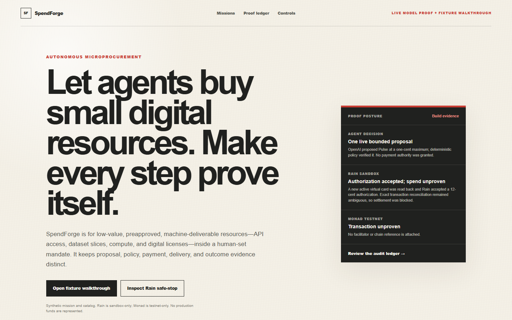

# SpendForge

SpendForge is autonomous microprocurement for low-value, preapproved,
machine-deliverable digital resources. An operator supplies a mission, fixed
catalog, bounded budget, and success criteria; a model may propose an API,
dataset slice, compute job, metered tool, or digital license, while deterministic
policy remains execution authority. Payment, delivery, and outcome evidence must
stay separate before a larger future budget can be proposed.

SpendForge is not presented as a replacement for negotiated contracts, legal or
tax review, vendor onboarding, enterprise software procurement, seat lifecycle,
renewals, or cancellations.

## Current status

**The recording build contains one durable live OpenAI purchase proposal, a
complete labeled fixture walkthrough, a proven Preview-only operation journal,
and partial Rain Sandbox evidence. One bounded Responses API call proposed the
Pulse resource with a one-cent maximum; deterministic policy verified it and did
not grant payment authority. Rain issued a fresh scoped card, direct GET matched
it as active and virtual, and Rain accepted a 12-USD-cent authorization. The
exact transaction readback later matched every causal field. SpendForge then
submitted exactly one settlement request; Rain returned HTTP 400 and three
bounded exact readbacks remained nonterminal. The outcome is ambiguous, so no
completed spend is claimed and settlement will not be retried. Historical
funding remains an uncorrelated HTTP 202 acknowledgment. A read-only Monad
facilitator capability preflight passed; no wallet, RPC, payment, or delivery
call occurred.**

The repository contains a production-buildable Next.js application with a deterministic Atlas mission, bounded purchase-proposal interface, policy engine, cross-rail ledger, protected-Preview/local artifact route, a current server-only Rain sandbox adapter, health endpoints, and automated tests. Fixture UI remains visibly labeled. See `DEMO-NOTES.md` for the exact deployed and provider-verified state.

The audited Rain sequence remains a
[no-go for an end-to-end spend claim](./docs/RAIN-WORKFLOW-VERDICT.md). The
authorization response is real sandbox evidence; it is not settlement or money
movement. All execution routes and mutation gates are closed in the final build.

Source repository: [VJDiPaola/SpendForge](https://github.com/VJDiPaola/SpendForge).
It has no open-source license; public visibility does not grant reuse rights.
Public fixture demo: [spendforge.vercel.app](https://spendforge.vercel.app).
Provider testing remains on the protected Preview; Production has no provider
credentials or mutation gates.



## Product boundary

- **Rain owns:** scoped cards, infrastructure-level spend controls, transaction authorization and settlement, transaction readback, and payment routes.
- **Monad/x402 owns:** HTTP payment negotiation, signature verification, facilitator settlement, wallet/network primitives, and optional agent identity/reputation.
- **SpendForge owns:** mission planning, cross-rail resource selection, outcome evidence, a unified audit ledger, and human-approved earned-authority proposals.

SpendForge must not rebuild capabilities already supplied by Rain or Monad.

## Architecture

```mermaid
flowchart LR
    O["Operator mission + budget"] --> A["Bounded agent purchase proposal"]
    A --> P["Deterministic policy verification"]
    P --> G["Per-operation kill switch, cap, attempt gate"]
    P --> U["Authenticated requiresHuman handoff"]
    U --> G
    G --> R["Rain sandbox boundary"]
    G --> X["Monad x402 v2 boundary"]
    R --> J["Append-only redacted operation journal"]
    X --> J
    J --> L["Unified audit ledger + downloadable receipt"]
    L --> C["Manifest composer + outcome evaluator"]
    C --> H["Human-reviewed future-limit proposal"]
```



The causal target is `objective -> bounded model proposal -> deterministic
policy verification -> exact-cap card or x402 test payment -> digital delivery
-> authoritative readback -> audit receipt`. Tonight's build proves the model,
policy, journal, and partial Rain boundaries independently; it does not pretend
the full chain completed.

Provider mutation responses and authoritative readbacks are separate states. A
Rain response is not called completed until the matching direct GET establishes
the expected provider state; an x402 settlement receipt and delivered resource
validation likewise remain separate evidence records.

The checked-in Rain journal is an earlier redacted archival capture. A Postgres
compare-and-set provider-operation journal is built, wired, and proven on a
dedicated free Preview-only Neon database. The
migration, restricted `SELECT`/`INSERT` runtime role, concurrent duplicate
barrier, and cross-connection persistence passed a synthetic protected-Preview
proof with zero provider calls. The same journal now holds the redacted live
model proof and the bounded Rain attempt, including encrypted server-only
recovery envelopes that are removed from downloadable receipts. This does
**not** make full mission runs, cumulative budgets, deliveries, or artifacts a
canonical causal graph. The runtime fails closed when persistence is absent or
unavailable. Every provider window remains closed. See the
[durable-journal setup](./docs/DURABLE-JOURNAL-SETUP.md).

For merchants without purchase APIs, the future
[Checkout Operator](./docs/CHECKOUT-OPERATOR.md) uses explicit delegated human
consent and `requiresHuman` states; MCP does not bypass CAPTCHA, 3DS, fraud
checks, login, or terms acceptance.

## Specification package

Start with [AGENTS.md](./AGENTS.md), then read [the package index](./spec/00-PACKAGE-INDEX.md).

1. [Product specification](./spec/01-PRODUCT-SPEC.md)
2. [Capability boundaries](./spec/02-CAPABILITY-BOUNDARIES.md)
3. [UX and demo specification](./spec/03-UX-AND-DEMO.md)
4. [Behavior and autonomy contract](./spec/04-BEHAVIOR-AND-AUTONOMY.md)
5. [Technical architecture](./spec/05-TECHNICAL-ARCHITECTURE.md)
6. [API and data contracts](./spec/06-API-AND-DATA-CONTRACTS.md)
7. [Eval and test plan](./spec/07-EVAL-AND-TEST-PLAN.md)
8. [Build handoff](./spec/08-BUILD-HANDOFF.md)
9. [Official source and resource catalog](./spec/09-RESOURCE-CATALOG.md)
10. [Submission and supporting materials](./spec/10-SUBMISSION-PACKAGE.md)

## Source provenance

Public implementation decisions are grounded in current official Rain, Monad,
x402, Next.js, and Vercel documentation plus redacted observed sandbox/testnet
evidence. Third-party organizer PDFs and the superseded concept memo are kept in
an owner-only archive outside this repository because redistribution permission
was not established. The public repository guard rejects those filenames and
the retired proof-route paths from reachable history.

## Run locally

```powershell
npm.cmd install
npm.cmd run dev
```

Open `http://localhost:3000/missions/atlas-launch-v1`.

Before any separately authorized provider mutation, complete the
[Preview database setup](./docs/DURABLE-JOURNAL-SETUP.md). Do not point the
application at a Production database or enable a provider gate merely to test
the journal.

## Verify

```powershell
npm.cmd run verify
npm.cmd run test:contract
npm.cmd run test:integration
```

The browser suite uses a separately owned local server on Windows so Playwright can exit cleanly:

```powershell
# Terminal 1
npm.cmd run build
npm.cmd run serve:e2e

# Terminal 2
npm.cmd run test:e2e
```

The fixture suite never invokes a live provider adapter. The bounded OpenAI and
Rain proofs ran only from protected Preview with exact one-shot gates. Those
routes were removed and every execution switch is closed. `sessionid` is
generated ephemerally on the server and is never an environment variable. The
official Monad/x402 v2 packages, protected seller route, durable buyer/seller
evidence seams, run-wide cap, and fake contract path are present. One read-only
`/supported` preflight advertised v2 `exact` on Monad Testnet; no wallet, RPC,
payment, settlement, or paid delivery call has been made.
