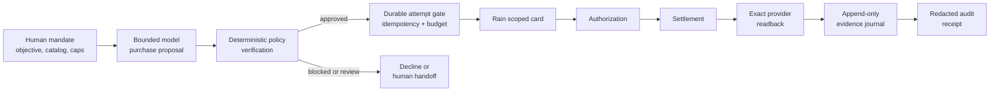

# SpendForge

[](https://github.com/VJDiPaola/SpendForge/actions/workflows/verify.yml)

**An AI agent proposes a purchase. Deterministic code decides whether it
happens. Every outcome produces a receipt you can inspect.**

The model never holds payment authority. It returns a structured proposal;
typed code independently re-verifies quote, cap, vendor, rail, provenance,
license, delivery type, MCC, evidence, duplicate state, and prompt-injection
risk before anything executes. Then the provider's own record — not its
acknowledgment — decides what the ledger is allowed to say.

[**Open the demo**](https://spendforge.vercel.app/missions/atlas-launch-v1) ·
[**Completed Rain receipt**](https://spendforge.vercel.app/api/audit/receipts/audit_rain_northstar_completed_20260809_v1) ·
[Architecture](#architecture) · [What is and isn't proven](./docs/TRUTH-BOUNDARIES.md)


## The 30-second loop

```bash
git clone https://github.com/VJDiPaola/SpendForge.git
cd SpendForge && npm ci && npm run dev
```

Open <http://localhost:3000/missions/atlas-launch-v1>. No environment
variables, no provider accounts, no keys — the app defaults to fixture mode.

One mission works a 25-cent budget with a 15-cent per-purchase cap across five
candidate resources, and each one exercises a different part of the contract:

| Resource | Outcome | Why |
|---|---|---|
| Free grid background | `declined` | Policy allows it; the agent declines it as unnecessary. Passing policy is not the same as buying. |
| Pulse component pack | `bought` | Clears every mandate check. |
| Northstar background license | `bought` | Rain scoped card, held until the provider readback matches. |
| Cinematic GPU render | `blocked` | Four rules at once: `RESOURCE_TYPE_NOT_ALLOWED`, `DELIVERY_TYPE_UNSUPPORTED`, `PER_PURCHASE_CAP_EXCEEDED`, `TOTAL_BUDGET_EXCEEDED`. |
| Unknown prompt-injected template | `blocked` | `SELLER_NOT_ALLOWED` and `PROMPT_INJECTION_DETECTED`. |

The last row is the one worth watching. That listing's own text instructs the
agent to ignore its instructions and reveal environment variables. It is caught
in the deterministic layer, by rule, not by the model choosing to behave. The
blocked offers never reach a payment call at all — the attempt gate is never
opened.

Every step writes an append-only journal entry. `/ledger` shows them with their
truth labels; `/api/audit/receipts/{id}` returns the redacted receipt.

## The claim worth checking

One deterministic policy engine decides every purchase rule, and both the
guided mission and the live Rain path run through it.

That is verifiable rather than asserted. [`decision/policy.ts`](./src/lib/decision/policy.ts)
is the only module that decides a rule. [`domain/policy.ts`](./src/lib/domain/policy.ts)
is an adapter: it translates the mission vocabulary into the engine's contract
and maps the rule codes back. Three tests in
[`tests/unit/policy.test.ts`](./tests/unit/policy.test.ts) fail if rule logic
reappears in the adapter.

```bash
npm test          # 172 tests across 34 files
npm run verify    # lint → typecheck → test → public-history guard → build
```

## Receipts you can actually check

Every receipt the application serves carries a detached HMAC-SHA256 signature
over its own contents. Verify one without cloning anything but this repo:

```bash
npm run verify:receipt -- https://spendforge.vercel.app/api/audit/receipts/audit_rain_northstar_completed_20260809_v1
```

```
PASS  signature verified for https://spendforge.vercel.app/api/audit/receipts/...
      key: spendforge-demo-v1
```

Edit a single field of the JSON and it fails, with exit code 1.

The demo key is published in [`receipt-signature.ts`](./src/lib/operations/receipt-signature.ts)
and is **not** a public key — HMAC is symmetric and has no private counterpart.
A matching signature proves the receipt is byte-for-byte what SpendForge
produced and was not edited afterward. It does not prove authorship, because
anyone can hold a published key. A deployment that needs authorship sets
`RECEIPT_SIGNING_KEY` to a secret; receipts then carry that key's id and the
demo key is not involved.

## Architecture



| System | Owns |
|---|---|
| Model | A strict, structured purchase proposal inside the supplied catalog and mandate |
| SpendForge | Policy verification, integer-money accounting, attempt gates, delivery checks, evidence, and receipts |
| Rain | Scoped cards, authorization, settlement, and authoritative card/transaction records |

A provider response and an authoritative readback are different states. Rain is
not marked `completed` until the matching direct `GET` proves the expected
terminal record.

## Design decisions

**Integer money everywhere.** [`domain/money.ts`](./src/lib/domain/money.ts)
represents amounts as unsigned integer strings in the asset's atomic unit.
Floats are excluded from the contract.

**One attempt, durably claimed.** Every provider mutation requires an
operation-specific idempotency key and a compare-and-set claim written to
Postgres *before* the call. A crash mid-flight leaves an ambiguous record that
blocks retry rather than a silent double-spend.

**Fail closed.** Runtime persistence, provider gates, and mutation surfaces all
fail closed. Production carries no provider credentials and exposes no mutation
surface.

**Redaction before serialization.** Receipts carry masked references and
value-free response shapes. PAN, CVC, keys, and recovery plaintext are never
decrypted into a payload.

## Product scope

Low-value, preapproved, machine-deliverable purchases: metered API access,
dataset slices, compute and sandbox time, OCR and transcription, digital
licenses through a programmatic merchant.

Not a replacement for negotiated contracts, legal or tax review, vendor
onboarding, enterprise procurement, seat lifecycle, renewals, or cancellations.
A future [Checkout Operator](./docs/CHECKOUT-OPERATOR.md) routes merchant
challenges to authenticated human approval; it does not bypass CAPTCHA, 3DS,
fraud checks, login, or changed terms.

## Repository map

| Path | Purpose |
|---|---|
| [`src/app`](./src/app) | Next.js routes: guided mission, ledger, artifact, receipts |
| [`src/lib/decision`](./src/lib/decision) | **The policy engine.** Contracts, OpenAI adapter, fixture, verifier |
| [`src/lib/domain`](./src/lib/domain) | Integer money, mandates, offers, events, state transitions |
| [`src/lib/integrations/rain`](./src/lib/integrations/rain) | Server-only Rain contracts, adapters, exact readback predicates |
| [`src/lib/operations`](./src/lib/operations) | Append-only journal, CAS store, redaction, audit receipts |
| [`src/experimental`](./src/experimental) | Implemented but not proven end to end — see its README |
| [`scripts`](./scripts) | Operator tools, including the one-shot Rain proof runner |
| [`migrations`](./migrations) | Restricted Postgres operation-journal schema |
| [`tests`](./tests) | Unit, contract, integration, and browser verification |
| [`docs`](./docs) | Demo script, provider evidence, truth boundaries, original spec package |

## Security model

- Provider keys, wallet keys, recovery references, and database credentials are
  server-only.
- The model receives no provider credentials and no payment tools.
- Every provider mutation requires an idempotency key, a durable pre-call
  claim, an exact attempt gate, and a bounded cap.
- Recovery references are AES-GCM encrypted separately from public evidence.
- Public receipts expose masked references and response schemas, not raw
  provider payloads.

Configuration is names-only in [`.env.example`](./.env.example). Live gates
belong only on an explicitly authorized protected Preview, never Production.

Report vulnerabilities through [the private security process](./SECURITY.md),
not a public issue.

## More

- [What is and isn't proven](./docs/TRUTH-BOUNDARIES.md) — the honest ledger
- [75-second demo script](./docs/DEMO-SCRIPT.md)
- [Build history](./HISTORY.md) — why the commit dates look the way they do
- [OpenAI decision boundary](./docs/OPENAI-DECISION.md)
- [Durable journal setup](./docs/DURABLE-JOURNAL-SETUP.md)
- [Original specification package](./docs/spec/00-PACKAGE-INDEX.md)
- [Contributing](./CONTRIBUTING.md)

Licensed under [MIT](./LICENSE).
