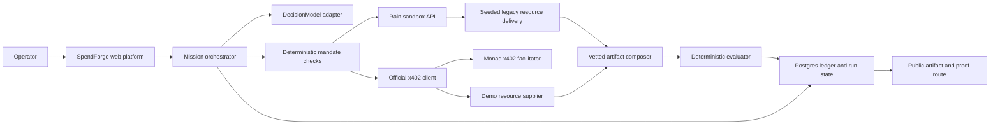
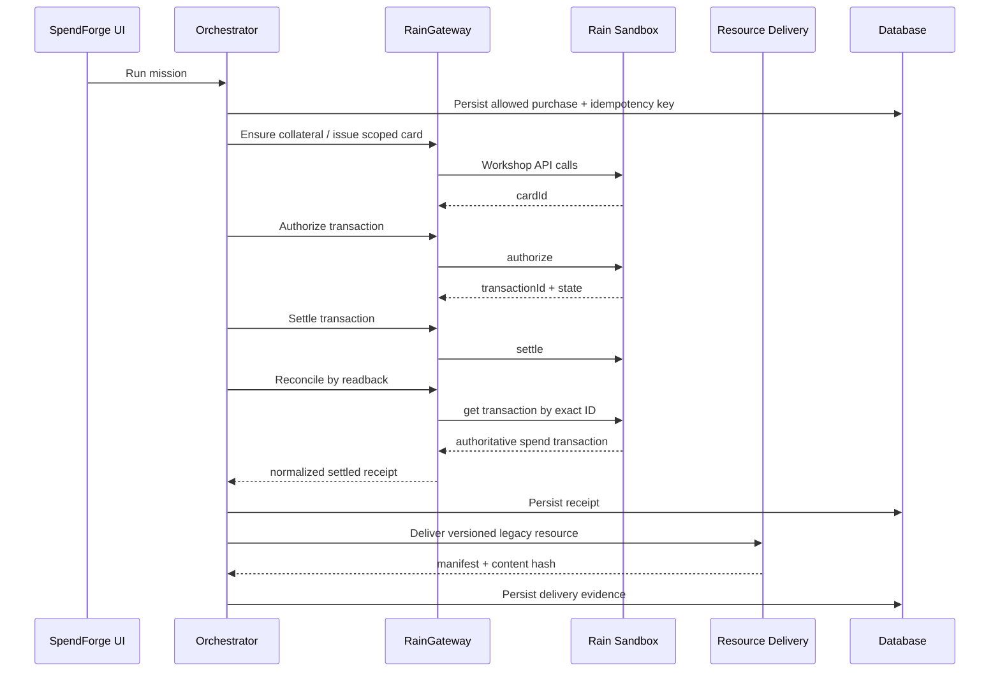
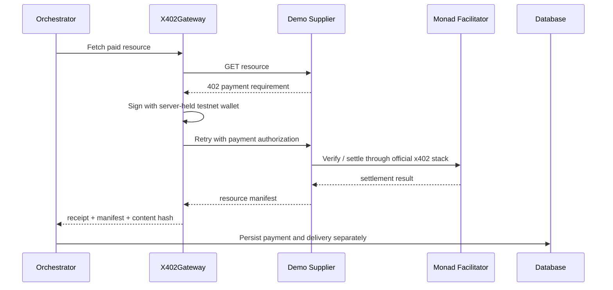

# Technical Architecture

## Architecture objective

Build the smallest production-shaped system that proves the full story: mission mandate, AI resource choice, two native payment rails, delivery, artifact composition, outcome evidence, reconciliation, and a public Vercel experience.

P0 deliberately avoids arbitrary code execution. Purchased components are vetted, manifest-driven modules that the application knows how to compose. This removes any requirement for Daytona, Modal, Claude Code, or another sandbox while preserving an adapter path for later compute missions.

## System context



## Component responsibilities

### Next.js web platform

- Renders the platform and public artifact routes.
- Uses Server Components for durable reads.
- Uses Server Actions for mission-form mutations.
- Uses Route Handlers for orchestration streaming, x402 seller endpoints, external callbacks, and health checks.
- Runs on the default Node.js runtime for provider SDK and crypto compatibility.

### Mission orchestrator

- Loads the mission, mandate, offers, and prior attempts.
- Requests a structured decision from `DecisionModel`.
- Applies deterministic hard rules.
- Invokes the correct payment adapter based on the seller's native rail.
- Persists every state transition before emitting it to the browser.
- Delivers resources only after provider-authoritative payment state.
- Invokes composition and evaluation.
- Produces an authority proposal only when the behavior contract allows it.

The orchestrator is a state machine, not an open-ended tool loop.

### DecisionModel adapter

- Converts mission and resource metadata into a validated `PurchaseDecision`.
- Supports one selected model provider at runtime.
- Receives no credentials, raw provider payloads, or private database fields.
- Has a deterministic fixture implementation for tests and replay only.

An actual model-backed decision is required for the live judged run. Fixture mode must remain visibly labeled.

### Mandate engine

- Performs exact integer budget arithmetic.
- Checks resource type, seller, price, deadline, provenance, delivery type, and idempotency.
- Returns `allowed`, `blocked`, or `escalate` with machine-readable rule codes.
- Does not claim to replace Rain controls or wallet-level policy.

### RainGateway

- Owns all Rain HTTP calls and authentication headers.
- Maps workshop responses into normalized provider receipts.
- Redacts sensitive data before logging or persistence.
- Reconciles the transaction list after timeout or uncertain mutation responses.

Exact schemas must be generated from the workshop playground during preflight.

### X402Gateway

- Uses official `@x402/core`, `@x402/evm`, `@x402/fetch`, and `@x402/next` packages as required by the installed version.
- Signs with a dedicated low-balance testnet agent wallet held only on the server.
- Uses the Monad facilitator and network identifiers from current official docs.
- Stores the payment requirement, settlement reference, resource response hash, and seller address.

Do not copy protocol internals into application code.

### Demo resource supplier

- Exposes one public x402-protected component resource.
- Uses a distinct testnet seller address.
- Returns a signed/versioned resource manifest after payment.
- Can run in the same repository for speed but must be labeled as a synthetic demo supplier.
- Must not share the buyer wallet.

If time permits, deploy the supplier as a second small Vercel project. This is presentation separation, not a functional requirement.

### LegacyResourceGateway

- Represents resource delivery from the seeded legacy merchant after Rain settlement readback.
- Delivers a versioned licensed-background manifest and content hash.
- Clearly labels the merchant and license as synthetic.
- Never claims the seeded asset seller actually received production card funds.

### Artifact composer

- Accepts only known component IDs, known asset IDs, text fields, and design tokens.
- Rejects scripts, arbitrary imports, HTML strings, executable packages, and unknown URLs.
- Persists the exact resource versions used in the artifact.
- Produces a public route from stored structured data.

### Evaluator

- Runs deterministic checks over the artifact manifest and rendered page.
- Required checks: resource presence, license/provenance, required sections, link validity, responsive layout, keyboard navigation, color contrast, and axe accessibility scan.
- Stores evaluator version, inputs, results, and timestamps.
- Does not use provider payment success as an outcome score.

### Persistence

Use Postgres-compatible persistence through `DATABASE_URL` for deployed mode. Use a repository interface so unit tests can use an in-memory implementation.

Persist:

- missions and mandates;
- resource offers and versions;
- runs and ordered run events;
- decisions and policy results;
- payment attempts and reconciliation records;
- deliveries and content hashes;
- artifacts and evaluations;
- authority proposals;
- idempotency keys.

Never depend on Vercel function memory across requests.

## Suggested project structure

```text
src/
  app/
    (marketing)/
      page.tsx
    (platform)/
      layout.tsx
      missions/
        page.tsx
        [missionId]/page.tsx
      catalog/page.tsx
      ledger/page.tsx
      policies/page.tsx
    artifacts/[artifactId]/page.tsx
    api/
      runs/[runId]/execute/route.ts
      runs/[runId]/route.ts
      resources/[resourceId]/route.ts
      integrations/health/route.ts
    error.tsx
    global-error.tsx
    not-found.tsx
  components/
    platform/
    artifact/
    ui/
  lib/
    domain/
      mission.ts
      mandate.ts
      decision.ts
      run-state.ts
      money.ts
    orchestration/
      execute-mission.ts
      emit-event.ts
    integrations/
      rain/
      x402/
      model/
      database/
    resources/
      catalog.ts
      manifests.ts
      legacy-delivery.ts
    artifact/
      compose.ts
      evaluate.ts
    security/
      redact.ts
      idempotency.ts
      trusted-origins.ts
tests/
  unit/
  contract/
  integration/
  e2e/
fixtures/
  replay/
  resources/
```

## Rain purchase sequence



Delivery must not happen on the basis of the initial authorization alone unless the resource explicitly supports authorization-only delivery. P0 requires settlement plus readback.

## Monad x402 purchase sequence



If payment settles but delivery fails, retain the payment receipt and mark delivery failed. Never rewrite it as an unpaid attempt.

## Runtime and streaming

`POST /api/runs/[runId]/execute` may stream newline-delimited JSON events. Every event is persisted before it is emitted. A client reconnect fetches canonical events from `GET /api/runs/[runId]` rather than relying on an interrupted stream.

Do not run the workflow in an untracked browser loop. The server owns the state machine.

## Security design

### Credential isolation

- All payment and model credentials are server-only environment variables.
- Integration modules use `server-only` imports.
- Redaction occurs before logs and database writes.
- Health endpoints report boolean configuration state, never values.
- Replay fixtures use synthetic identifiers and addresses unless a public transaction reference is intentionally retained.

### Payment safety

- Dedicated low-balance testnet wallet.
- Distinct buyer and seller wallets.
- Integer money representation.
- Idempotency key per mission, offer, rail, and attempt generation.
- Trusted-origin and CSRF checks on mutating routes.
- Rate limiting on public run controls.
- Provider readback before terminal success.

### Resource safety

- JSON schema validation on every resource manifest.
- Allowlisted resource IDs and content hashes.
- No dynamic script execution or arbitrary remote import.
- Asset URLs copied or proxied through controlled storage before use.
- Prompt-injection strings in seller metadata are treated as untrusted data.

## Deployment design

- Vercel project with production and preview environments.
- Node.js runtime for integration routes.
- Environment variables separated by Vercel environment.
- Database migrations run explicitly; never during every request.
- Public artifact and proof routes must work logged out.
- Runtime logs include `requestId`, `runId`, `missionId`, adapter name, and redacted provider state.
- Never log full request/response bodies from payment providers.

## Replay architecture

A verified live run can be exported into a redacted `RunReplay` fixture containing:

- ordered events;
- environment labels;
- redacted receipt references;
- resource hashes;
- artifact manifest;
- evaluation results;
- capture timestamp and source run ID.

Replay mode renders the same UI through a separate adapter and a visible `REPLAY` badge. It never calls provider APIs and never overwrites live state.

## Optional compute extension

Post-P0, arbitrary compute can implement:

```ts
interface ComputeResourceProvider {
  quote(request: ComputeRequest): Promise<ResourceOffer>;
  execute(receipt: PaymentReceipt, request: ComputeRequest): Promise<DeliveryEvidence>;
  inspect(jobId: string): Promise<ComputeJobState>;
  terminate(jobId: string): Promise<void>;
}
```

The interface allows Daytona, Modal, Vercel Sandbox, or another provider without changing the payment, evidence, or ledger domain model.
