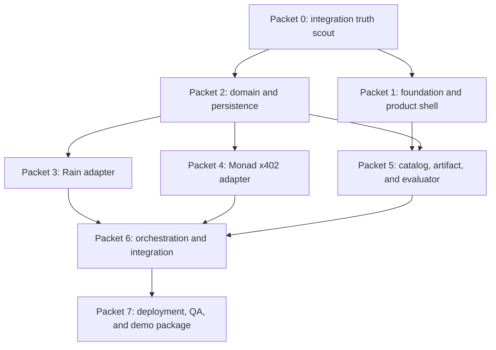

# Build Handoff

## Handoff objective

This package is designed for several agents to implement without independently redefining the product. Agents may work in parallel only where file ownership does not overlap. One integration owner controls provider truth, shared domain contracts, and final merges.

## Before any feature code

The integration owner completes a 45-minute preflight:

1. Obtain Rain workshop credentials from the event desk.
2. Verify authenticated access without exposing values.
3. Inspect exact Rain playground schemas and save redacted examples.
4. Create distinct Monad testnet buyer and seller addresses.
5. Fund the buyer with testnet USDC and MON.
6. Call the facilitator's `/supported` endpoint.
7. Inspect current `@x402/*` package exports and choose compatible pinned versions.
8. Confirm an available Postgres-compatible database and successful Vercel preview connection.
9. Select the model provider that is already accessible.
10. Deploy a Next.js hello world to Vercel.

Record results in `docs/DEMO-NOTES.md`. If an integration remains unproven after 45 minutes, preserve the live adapter task and continue UI/domain work with a visibly labeled fixture. Do not downgrade the final challenge requirement silently.

## Workstream dependency graph



## Packet 0: Integration truth scout

**Owner:** integration owner
**Read:** `02-CAPABILITY-BOUNDARIES.md`, `06-API-AND-DATA-CONTRACTS.md`, `09-RESOURCE-CATALOG.md`

### Deliverables

- Redacted Rain request/response samples under `fixtures/provider/rain/`.
- Runtime schemas matching observed Rain responses.
- Pinned x402 package choice documented in `package.json` and lockfile.
- Redacted facilitator `/supported` fixture.
- Testnet buyer/seller public addresses documented without private keys.
- Database and Vercel preview smoke proof.
- Updated environment section in `docs/DEMO-NOTES.md`.

### Stop conditions

- Do not guess an unavailable Rain field.
- Do not use a public-doc sample resource ID as an account-valid ID.
- Do not put credentials in fixtures or commit history.

## Packet 1: Foundation and product shell

**Suggested branch:** `feat/platform-shell`
**Owns:** `src/app/**`, `src/components/**`, styles, static icons
**Read:** `03-UX-AND-DEMO.md`, `05-TECHNICAL-ARCHITECTURE.md`

### Deliverables

- Next.js App Router project.
- Landing, missions, catalog, ledger, policies, and artifact routes.
- Responsive design system and environment badges.
- Ready, loading, error, reconciliation, completed, and replay views using typed fixtures.
- Stable `data-testid` values from the UX spec.
- Vercel preview deployment.

### Acceptance

- Visually coherent at 1440x900 before integration work.
- No provider call from a Client Component.
- No secret-shaped placeholders in browser output.

## Packet 2: Domain and persistence

**Suggested branch:** `feat/domain-ledger`
**Owns:** `src/lib/domain/**`, database adapter/schema, repositories, unit tests
**Read:** `04-BEHAVIOR-AND-AUTONOMY.md`, `06-API-AND-DATA-CONTRACTS.md`, `07-EVAL-AND-TEST-PLAN.md`

### Deliverables

- Money, mandate, decision, payment, delivery, artifact, evaluation, and run-event types.
- Runtime validation schemas.
- State-machine transition guards.
- Postgres and in-memory repositories.
- Idempotency and reconciliation records.
- Seeded mission and resource offers.
- Unit tests for every hard rule.

### Acceptance

- Domain layer imports no provider SDK.
- No floating-point money.
- Database uniqueness prevents duplicate attempts.

## Packet 3: Rain adapter

**Suggested branch:** `feat/rain-sandbox`
**Owns:** `src/lib/integrations/rain/**`, Rain contract/integration tests
**Depends on:** Packets 0 and 2

### Deliverables

- Server-only Rain client.
- Typed methods for the verified workshop sequence.
- Response normalization and redaction.
- Reconciliation by transaction readback.
- One complete sandbox smoke script.
- Contract and live integration tests.

### Acceptance

- Final success comes from `GET /issuing/transactions` readback.
- No credential or sensitive card data reaches logs/domain responses.
- Ambiguous responses remain non-terminal.

## Packet 4: Monad x402 adapter and supplier

**Suggested branch:** `feat/monad-x402`
**Owns:** `src/experimental/x402/**`, `src/app/api/resources/**`, x402 tests
**Depends on:** Packets 0 and 2

### Deliverables

- Official x402 v2 client configured for Monad testnet.
- Distinct buyer and seller testnet wallets.
- One x402-protected resource manifest endpoint.
- Facilitator/chain receipt normalization.
- Delivery content hash and schema validation.
- Contract and live integration tests.

### Acceptance

- A real testnet payment unlocks the resource.
- Buyer and seller public addresses differ.
- Package APIs match the installed version, not copied examples.

## Packet 5: Catalog, artifact, and evaluator

**Suggested branch:** `feat/artifact-proof`
**Owns:** `src/lib/resources/**`, `src/lib/artifact/**`, artifact components, evaluator tests
**Depends on:** Packets 1 and 2

### Deliverables

- Seeded normalized catalog.
- Signed/versioned resource manifest schemas.
- Northstar background and Pulse component resources.
- Manifest-only artifact composer.
- Public artifact route.
- Deterministic mission evaluator.
- Prompt-injected and over-budget offers for blocked/declined paths.

### Acceptance

- Purchased resources visibly affect the artifact.
- Unknown code, imports, scripts, and URLs are rejected.
- Evaluation can be repeated with identical results.

## Packet 6: Orchestration and integrated mission

**Suggested branch:** `feat/mission-orchestration`
**Owns:** `src/lib/orchestration/**`, run endpoints, integration wiring
**Depends on:** Packets 2-5

### Deliverables

- Provider-neutral `DecisionModel` and selected live model adapter.
- Structured proposal validation.
- Deterministic mandate checks.
- Persisted run event stream.
- Correct sequencing across payments, delivery, composition, and evaluation.
- Authority proposal generation.
- Redacted replay export and replay adapter.

### Acceptance

- One click executes the bounded happy path.
- No provider secret enters a model request.
- Payment, delivery, and outcome remain distinct.
- Refresh reconstructs canonical state.

## Packet 7: Deployment, QA, and demo package

**Suggested branch:** `chore/demo-release`
**Owns:** Playwright, visual checks, README updates, submission assets, `docs/DEMO-NOTES.md`
**Depends on:** Packet 6

### Deliverables

- Production Vercel deployment.
- Playwright happy and failure paths.
- Accessibility and viewport QA.
- Verified live run and redacted replay.
- Screenshots, architecture diagram, one-page truth sheet, and demo script.
- Supercut recording plus local backup.

### Acceptance

- Deployed URL works in incognito.
- Live provider proof is captured.
- Replay is explicitly labeled.
- Final video works while logged out.

## Merge and file-ownership rules

- Packet 2 owns shared domain types until merged. Other packets import them and do not redefine them.
- Packet 1 owns shared UI primitives until merged.
- Provider packets do not edit each other's directories.
- Packet 6 starts only after provider adapter contracts are stable.
- Rebase or merge only at working checkpoints.
- Keep commits narrow and descriptive.
- Do not commit `.env` files, provider keys, or unredacted responses.

## Recommended build order under hackathon time pressure

1. **0:00-0:45:** Packet 0 preflight and hello-world deployment.
2. **0:45-2:00:** Packets 1 and 2 in parallel.
3. **2:00-4:00:** Packets 3, 4, and 5 in parallel after domain contracts land.
4. **4:00-5:30:** Packet 6 integration.
5. **5:30-6:30:** Packet 7 QA, live proof capture, and first recording.
6. **Final protected block:** Bug fixes only, final Supercut take, submission form, logged-out checks.

The schedule is a sequencing tool, not evidence that any phase is complete.

## Time-box fallbacks

| Blocker | 45-minute fallback | Truth requirement |
|---|---|---|
| Rain schema/auth unavailable | Continue with schema-valid fixtures; keep integration status blocked | Cannot claim Best Use of Rain success without live sandbox proof |
| Monad faucet delay | Build seller/client with fixtures; retry faucet in parallel | Cannot claim x402 payment without testnet receipt |
| Database provider unavailable | Use local Postgres for build; choose Vercel-compatible provider before demo | Public completed run must persist across requests |
| Model provider unavailable | Use fixture adapter for UI; select any accessible structured-output model before live demo | Replay/fixture badge required until actual model run |
| Separate seller deployment fails | Host supplier route in same project with distinct wallet | Disclose synthetic demo supplier |
| Supercut issue | Use native local screen recording and preserve unedited backup | Test final link logged out |

## Agent completion report template

Each workstream returns:

```markdown
## Outcome
[What now works]

## Files changed
[Paths]

## Provider truth used
[Docs, package exports, schemas, or live resources]

## Verification
[Commands and results]

## Known gaps
[Anything fixture-only, unconfirmed, or deferred]

## Handoff
[Exact next step and required inputs]
```

## Final definition of done

The project is done only when every release gate in `07-EVAL-AND-TEST-PLAN.md` passes and the final state in `docs/DEMO-NOTES.md` distinguishes live, sandbox, testnet, synthetic, and replay elements accurately.
